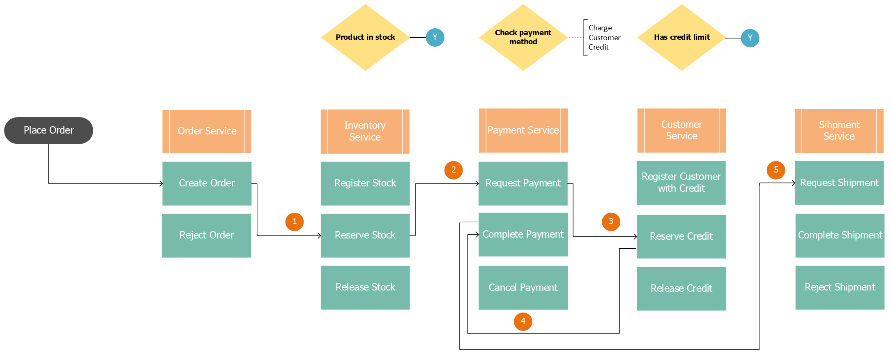
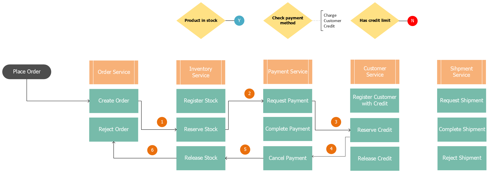
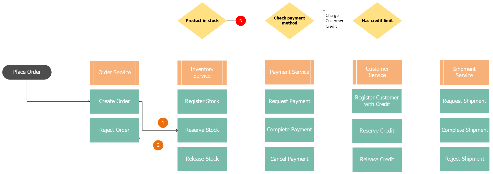

# Quarkus Ecommerce

## What are we doing here ?

- Event-Driven Architecture

- Domain Driven Design (DDD)

- SAGA Pattern ( Distributed transaction ): process & rollback ( compensating transactions )

- Outbox Pattern: Avoid dual-writes, no 2PC required using `Kafka`,`Kafka Connect`, `Debezium`, `Outbox Event Router`

- Kafka Messaging Systems for SAGA Orchestration

- Outbox CDC to kafka topics (Debezium)

## Services
| Service name    | Endpoint       |
|-------------------|----------------|
| Order service     | localhost:8084 |
| Customer service  | localhost:8085 |
| Payment service   | localhost:8086 |
| Inventory service | localhost:8087 |
| Shipment service  | localhost:8088 |
| Discovery service | localhost:8089 |


## Prerequisite
- Framework: Quarkus 3.5.2
- Language: Java 17
- Build Tool: Gradle

## Get Started
### Setup environment

```shell
docker-compose up -d
```

### Build projects
```shell script
./gradlew
```

### Start outbox connectors

Create outbox connectors

```shell
sh register-connectors.sh
```

### Clean Up

Delete all connectors

```shell
sh delete-connectors.sh
```

## Testing
### Scenario
Register a new customer with credit<br />
Set an inventory stock<br />
Customer uses its own account credit to finalize an order
 
> Events - CustomerCreated &#xb7; ProductRegisteredInStock &#xb7; (Saga Run) OrderCreated &#xb7; ProductStockReserved &#xb7; PaymentRequested &#xb7; CustomerCreditReserved &#xb7; PaymentCompleted &#xb7; ShipmentRequested
```bash
e2e-test/customer-uses-account-credit.sh
```



### Scenario
Register a new customer with credit<br />
Set an inventory stock<br /> 
Customer exceeds its own account credit to finalize an order<br />
Order is rejected

> Events - CustomerCreated &#xb7; ProductRegisteredInStock &#xb7; (Saga Run) OrderCreated &#xb7; ProductStockReserved &#xb7; PaymentRequested &#xb7; CustomerCreditLimitExceededEvent &#xb7; PaymentCancelled &#xb7; ProductStockRelesed &#xb7; OrderRejected
```bash
e2e-test/customer-exceeds-account-credit.sh
```



### Scenario
Register a new customer with credit<br />
Set an inventory stock<br />
Product is out of stock<br />
Order is rejected

> Events - CustomerCreated &#xb7; ProductRegisteredInStock &#xb7; (Saga Run) OrderCreated &#xb7; ProductOutOfStock &#xb7; OrderRejected
```bash
e2e-test/product-out-of-stock.sh
```

